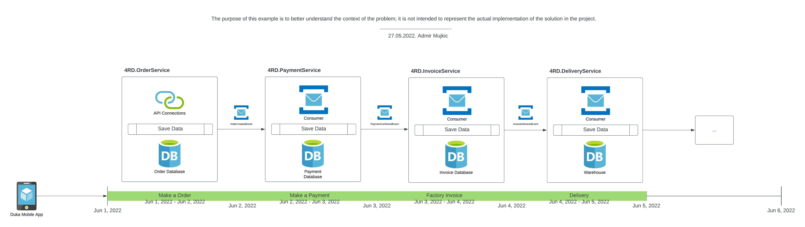
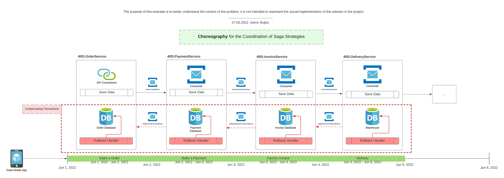
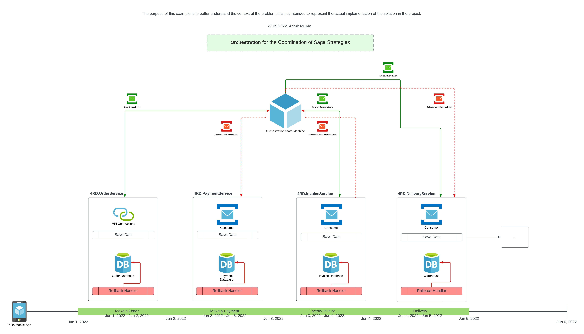

## A straightforward demonstration of the construction order of a single-state state machine based on the example of 4RD.

### **Saga Problem Context**

As you are aware, we are applying the approach of microservice architecture, which, in its proper context, is a distributed system because it is predominately driven by asynchrony and makes use of global events.

We make extensive use of distributed transactions, in which a number of services, which may be called in either sequential or parallel fashion, work together to finish a single transaction.

In this particular instance, we are not properly capturing transactions that are taking place across multiple services. Furthermore, we are not properly utilizing ACID transactions in microservices in order to guarantee that data consistency is maintained and to roll back, respectively.

Following that mindset we are dealing with a transaction that involves several different services and, in many instances, calls for a significant amount of time to be completed presents a difficult challenge. In this particular scenario, the application is required to make use of a complex mechanism in order to manage transactions

### **Scenario and Data Flow**

Accordingly, allow me to describe a situation in which you will help you to understand that needs.

Since we are using the AAF framework as part of 4RD is built using an architecture that is comprised of microservices. Take, for instance, the online retailer Duka, which allows customers to both place orders and makes payments.

The workflow transaction begins at the order service by initially creating an order. This is accomplished through the use of a straightforward call to the REST API. A global event, similar to OrderCreatedEvent, must be triggered when using this service as it is the responsibility of OrderService.

The subsequent service will subscribe to the OrderCreatedEvent and begin handling the business requirements for making payment, followed by creating an invoice for the transaction, after which sending for shipping, and finally order delivery and completing the workflow, with each implementation handling their own local transactions.

Everything here is performed using an approach similar to choreography (there is no orchestrator for control events)

Because of the decentralized nature of the order processing in this setting, the workflow may not be finished for several days or even weeks. Because of this, it is possible to refer to this kind of transaction as a long-running transaction due to the fact that all steps cannot be executed in a single go and make use of the conventional ACID transaction semantics.

### **Challenges**

Due to the fact that our architecture is based on microservices and we approach things using an event-style approach, there is primary issues with regard to distributed transaction management:

In order for a transaction to be considered atomic, every step in the process must be completed successfully. If any step fails, the rest of the transaction should be rolled back. Transactions are typically handled by one or more microservices in a microservices architecture. In the event that one of the local transactions fails, how can the successful transactions that were previously completed be rolled back?
SAGA, a transaction management system, is a solution to these issues and provides an efficient means of handling transactions.

To solve the more complex problem of maintaining data consistency in a microservices architecture, an application must employ a mechanism based on loosely coupled, asynchronous services. Here is where sagas come into play. Saga is an architectural pattern that offers an elegant method for implementing a transaction that spans multiple services and is asynchronous and reactive by nature.

Therefore, a saga is an event-driven sequence of local transactions, where each local transaction updates the database and publishes a command or event to trigger the subsequent local transaction in the saga. If a local transaction fails due to a business rule violation, the saga executes a series of compensating transactions that undo the changes made by preceding local transactions.

The saga implementation guarantees atomicity by ensuring that all transactions are executed or all changes are rolled back. Modeling a saga as a state machine will provide anti-isolation countermeasures.

Using an architecture based on microservices, a single business process can bring together several different microservices to produce a comprehensive solution. Implementing ACID transactions (Atomicity, Consistency, Isolation, and Durability) by utilizing a microservices architecture is hugely challenging and, in some cases, even impossible.

To undo anything that occurred due to the transaction, compensating measures must be taken. For instance, in the aforementioned scenario, a micro-service with the functionality to place an order cannot acquire a lock on the payment database, as it is typically an external service. However, some form of transaction management is still necessary, and such transactions are known as base transactions: Essentially Available, Soft state, and eventually consistent.

### **Strategies for the Coordination of Sagas**

The SEC, the Saga Execution Coordinator, is essential for putting together a functional saga flow. Implementation of saga coordination is possible in the following:
Choreography-based sagas

The participants in the saga should take turns making decisions and determining the order of events for the choreography. To put it another way, participants trade events without relying on a single command and control node, and each local transaction publishes domain events that in turn cause local transactions to be triggered in other services.

Even though saga choreography is an easy and dependable method of event-based communication, it is best suited for straightforward applications because it possesses certain limitations that prevent it from being a strong contender for the role of managing distributed transactions.

Choreography-based sagas are notoriously difficult to comprehend; they frequently give rise to cyclic dependencies; and there is a possibility of participants in the saga becoming tightly coupled with one another.

### **Orchestration for the Coordination of Saga Strategies**

The coordination logic of a saga ought to be centralized in a class that is referred to as the saga orchestrator. An individual who issues commands to the involved in a saga and takes action based on the outcomes of the events that occur is known as the saga's orchestrator.

The orchestrator is accountable for carrying out saga requests, storing and interpreting the various states that each task is in, as well as managing the failure recovery process through the use of compensating transactions (the red ones). Sagas that are managed by an orchestrator are better suited for handling complex event processing, which makes them a promising candidate for the management of distributed transactions.

According to the "orchestration" pattern proposed by Saga, there is a single component known as the orchestrator that is in charge of managing the workflow of the entire process. When you use orchestration, you will need to define an orchestrator class.

The sole responsibility of this class will be to provide direction to the saga participants. The interaction between the saga orchestrator and the participants takes the form of a command and an asynchronous reply. In order to carry out a saga step, it sends a command message to a participant, informing the participant of the operation that it should carry out.

Following the completion of the task, the participant in the saga will communicate its results to the orchestrator via a reply message. After receiving the message, the orchestrator analyzes it and decides which subsequent saga step should be carried out.

